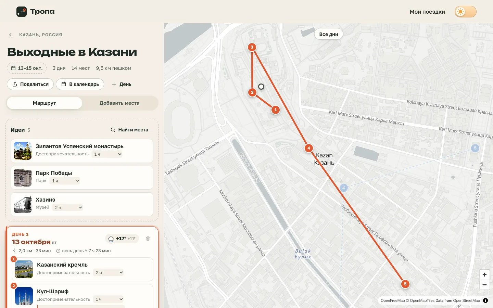
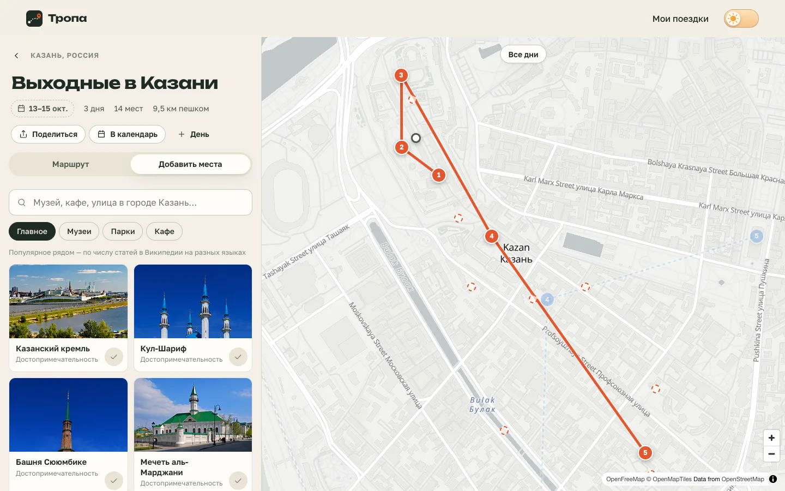
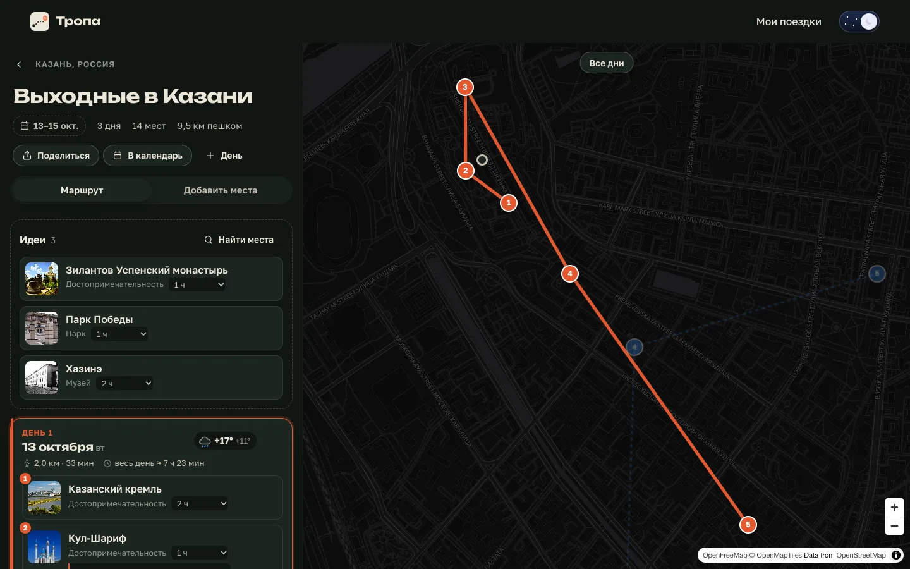
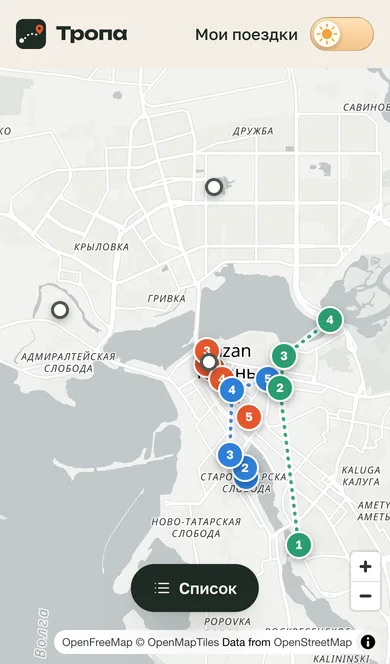

<div align="center">

<a href="https://dmitriy9427.github.io/tropa/"></a>

# 🧭 Тропа

**Планировщик путешествий: места по дням, карта маршрута и погода — пет-проект на Next.js и TypeScript**

### [Открыть демо →](https://dmitriy9427.github.io/tropa/)

      [](https://github.com/dmitriy9427/tropa/actions/workflows/pages.yml)

</div>

| Главная | Подборка мест | Ночная тема |
| --- | --- | --- |
|  |  |  |

## Коротко

| | |
| :---: | --- |
| 🗺 | **Карта маршрута** — каждый день своим цветом; при выборе дня камера перелетает к нему, а линия маршрута прорисовывается от первой точки к последней |
| ✋ | **Перетаскивание** — места между днями мышью, пальцем и с клавиатуры, с озвучкой для скринридера |
| 🏛 | **Подборка мест** — популярное рядом из Wikidata с фото, музеи, парки, кафе и поиск по названию |
| ☁️ | **Погода на 16 дней** — у каждого дня; дождливые дни подсвечены |
| 🔗 | **Без сервера** — поездки хранятся в браузере, ссылка «поделиться» содержит всю поездку, экспорт в календарь (.ics) |
| ✅ | **Качество** — строгий TypeScript, тесты на всю логику, ESLint, доступность, «меньше движения» |

Автор — [Дмитрий Рябов](https://dmitriy9427.github.io/resume/), frontend-разработчик.

---

## Что есть

- **Главная** — форма «куда и когда» с поиском города (паттерн доступного
  combobox), список сохранённых поездок и кнопка «Посмотреть пример» — готовые
  выходные в Казани. Фон — топографические линии, которые сервер генерирует
  при сборке (marching squares), в браузер приходит готовый SVG.
- **Планировщик** — «Идеи» и дни поездки. У дня: дата, прогноз погоды,
  километраж и время пешком, общее время с учётом посещения мест. У места: фото,
  тип, сколько времени заложить, заметка.
- **Карта** — MapLibre GL на бесплатных тайлах OpenFreeMap. Номера меток
  совпадают со списком; наведение на карточку подсвечивает метку и наоборот.
  Светлый и тёмный стиль карты переключаются вместе с темой сайта.
- **Добавление мест** — подборки «Главное / Музеи / Парки» (Wikidata,
  отсортировано по популярности), «Кафе» (OpenStreetMap), поиск по названию
  (Photon). Найденное показывается на карте пунктирными кружками.
- **Поделиться** — поездка сжимается прямо в ссылку; у получателя она
  сохраняется в «Мои поездки». На телефоне — системное меню «Поделиться».
- **Телефон** — список и карта переключаются кнопкой; перетаскивание — долгим
  нажатием, чтобы список можно было прокручивать.

| Телефон: список | Телефон: карта |
| --- | --- |
|  |  |

## Стек

**Next.js 16** (App Router, статический экспорт) · **React 19** · **TypeScript** ·
**Zustand** (состояние + localStorage) · **TanStack Query** (запросы и кеш) ·
**dnd-kit** (перетаскивание) · **MapLibre GL** (карта) · **lz-string** (ссылка
«поделиться») · SCSS Modules · Vitest · ESLint.

Данные: Open-Meteo (города и погода), Wikidata и Wikimedia Commons
(достопримечательности и фото), OpenStreetMap через Overpass и Photon (кафе,
поиск), OpenFreeMap (подложка карты). Все сервисы бесплатные и без ключей.

## Как устроено

Подробно — в [docs/](docs/README.md):
[архитектура](docs/01-architecture.md) ·
[Next.js простым языком](docs/02-nextjs.md) ·
[состояние и данные](docs/03-state-and-data.md) ·
[перетаскивание](docs/04-drag-and-drop.md) ·
[карта](docs/05-map.md) ·
[деплой](docs/06-deploy.md).

## Запуск

```bash
npm install
npm run dev      # http://localhost:3000
npm run check    # линтер, типы, тесты, сборка
```

Сборка (`npm run build`) кладёт готовый статический сайт в `out/`.
Деплой на GitHub Pages — автоматически при пуше в `main`.
